# 🗄️ Caching — The Complete Guide
> *How the world's fastest systems serve billions of users without breaking a sweat*

---

## Table of Contents

1. [What Is Caching?](#what-is-caching)
2. [Real-World Examples at Scale](#real-world-examples-at-scale)
   - [Google Search](#-google-search)
   - [Netflix CDN](#-netflix-cdn)
   - [X / Twitter Trending](#-x--twitter-trending)
3. [Levels of Caching](#levels-of-caching)
   - [Network Level](#1-network-level)
   - [Hardware Level](#2-hardware-level)
   - [Software Level](#3-software-level)
4. [In-Memory Databases — Redis Deep Dive](#in-memory-databases--redis-deep-dive)
   - [Why In-Memory?](#why-in-memory)
   - [Caching Strategies](#caching-strategies)
   - [Eviction Policies](#eviction-policies)
5. [Common Backend Use Cases](#common-backend-use-cases)
6. [Quick Reference Cheat Sheet](#quick-reference-cheat-sheet)

---

## What Is Caching?

Imagine you're a librarian. Every time someone asks for the same popular book, you could walk to the far corner of the library, find it on the shelf, and bring it back — or you could keep that popular book right on your desk. The second approach is **caching**.

**Caching** is the practice of storing the results of expensive or slow operations in a fast, temporary storage layer so that future requests for the same data can be served instantly — without repeating the original work.

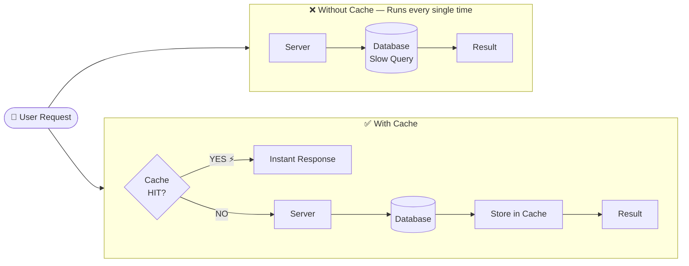

> **The core trade-off:** Speed vs. Freshness. Cached data is fast but might be slightly stale. You decide how acceptable that is for your use case.

---

## Real-World Examples at Scale

### 🔍 Google Search

**The Problem:** When 10 million people search "weather today" every hour, does Google re-crawl the entire internet and re-rank billions of pages every single time? Absolutely not — that would be impossibly slow and expensive.

**The Solution:** Google uses a **distributed in-memory cache**. The first time a popular query runs, the system does the heavy lifting (ranking, filtering, personalisation). That result is stored in cache. Every subsequent user gets the cached result back in milliseconds.

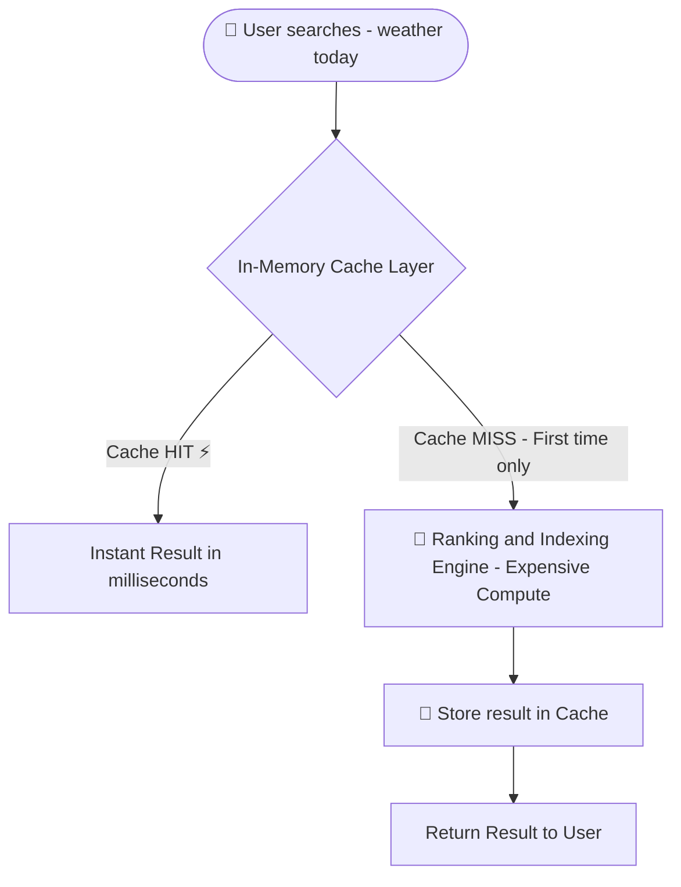

**What this achieves:**
- Drastically reduced **latency** (from seconds to milliseconds)
- Massively reduced **server load** — one computation serves millions
- Lower **infrastructure cost**

---

### 🎬 Netflix CDN

**The Problem:** Netflix has a single origin server where all video files live. If every user on Earth streamed directly from that one server, the latency for someone in Mumbai watching a US-hosted file would be unbearable — and the bandwidth would collapse.

**The Solution:** **Content Delivery Networks (CDNs)**. Netflix copies ("caches") its most popular content onto hundreds of **Edge Servers** distributed around the globe. When you press play, you stream from a server just ~50 km away — not 10,000 km.

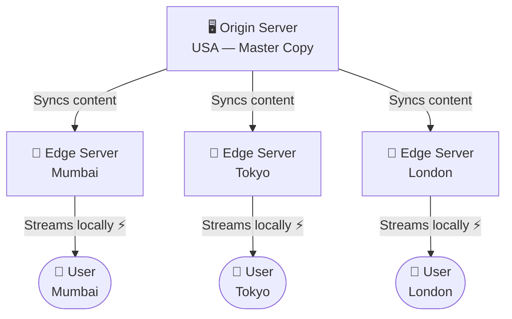

**What this achieves:**
- **Minimal buffering** — data travels a fraction of the distance
- **No single point of failure** — if one edge server goes down, others serve users
- **Infinite scalability** — traffic is distributed, not centralised

---

### 🐦 X / Twitter Trending

**The Problem:** Calculating "What's Trending?" involves running complex ML algorithms across hundreds of millions of tweets in near real-time. If Twitter recalculated this for every user page load, their servers would implode.

**The Solution:** Twitter runs the expensive ML computation once every few minutes and **caches the result in Redis**. Every user reads from this cache — not from a fresh computation.

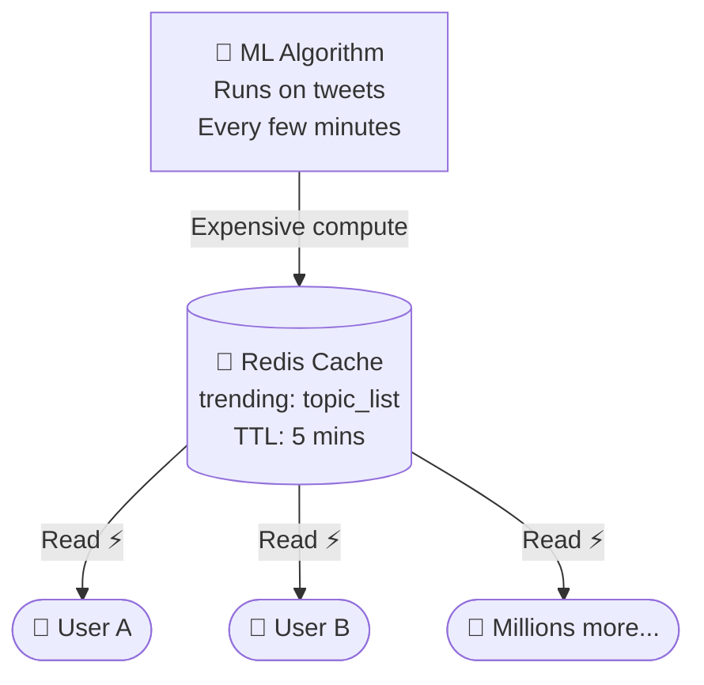

> **Key insight:** Trending topics that are 3 minutes old are perfectly acceptable. The staleness is invisible to users, but the speed and scale gains are enormous.

---

## Levels of Caching

Caching isn't just one thing — it happens at multiple layers of the technology stack simultaneously.

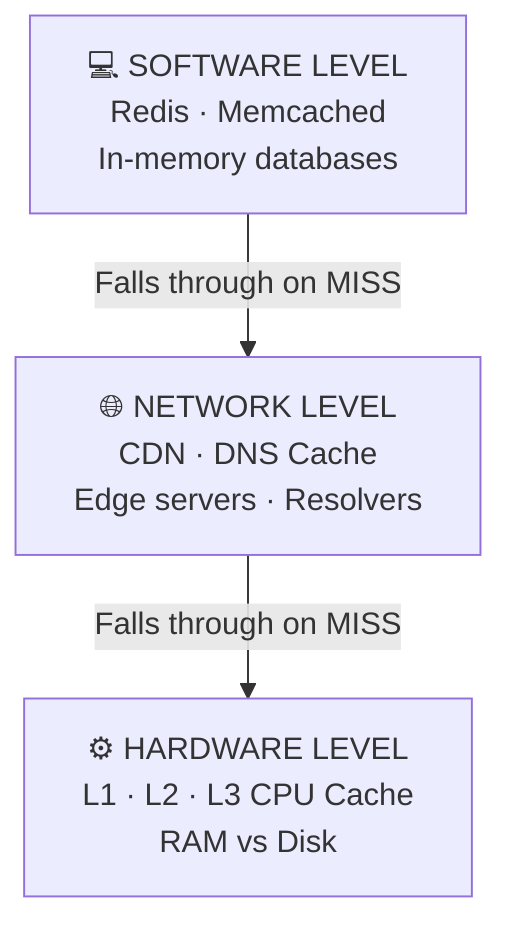

| Level | Examples | Speed | Size |
|-------|----------|-------|------|
| Software | Redis, Memcached | ~microseconds | GBs |
| Network | CDN, DNS cache | ~milliseconds | TBs |
| Hardware | L1/L2/L3, RAM | ~nanoseconds | MBs–GBs |

---

### 1. Network Level

#### CDNs (Content Delivery Networks)
As shown in the Netflix example, CDNs cache static assets (videos, images, JS, CSS) at edge locations worldwide. This is why a website's images load fast even when its servers are on the other side of the planet.

#### DNS Caching

Every time your browser visits `google.com`, it needs to resolve the domain to an IP address (`142.250.80.46`). This lookup is cached at multiple layers to avoid repeating the slow recursive process:

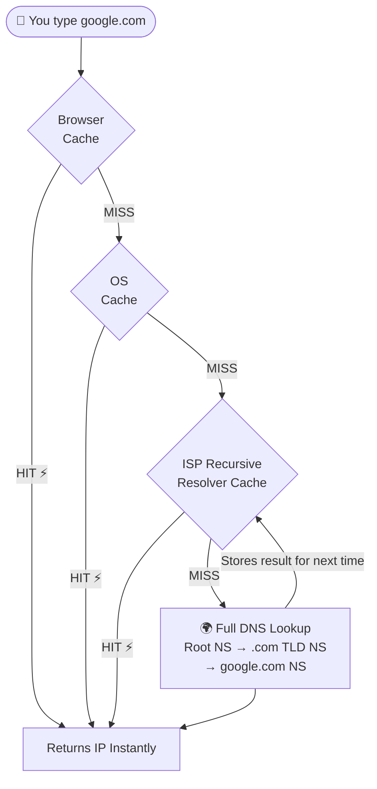

Each layer has its own **TTL** — a timer that says "forget this cached entry after X seconds." This is how DNS changes (e.g., a site moving to a new server) eventually propagate everywhere.

---

### 2. Hardware Level

#### CPU Cache (L1 / L2 / L3)

Your CPU runs billions of operations per second. If it had to fetch data from RAM every time, it would spend most of its time waiting. So CPUs have tiny but blazingly fast caches built right onto the chip.

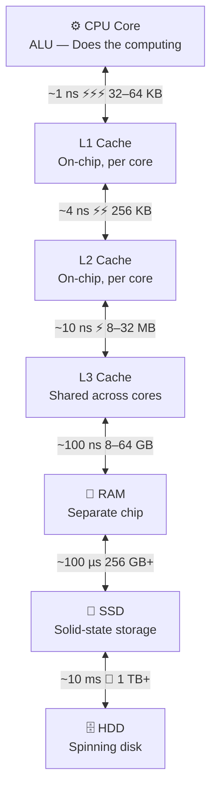

#### Why RAM Is So Much Faster Than Disk

RAM stores data as **electrical signals** — accessing it is as fast as flipping a switch. A hard disk drive (HDD) has a spinning magnetic platter and a mechanical arm that physically moves to read data. This is why RAM is ~100,000× faster than an HDD. Even SSDs, which have no moving parts, are still ~1,000× slower than RAM due to higher bus latency.

---

### 3. Software Level

This is the level most backend developers interact with directly — databases like **Redis** or **Memcached** that live entirely in RAM and act as a super-fast middle layer between your app and your main (slow) database.

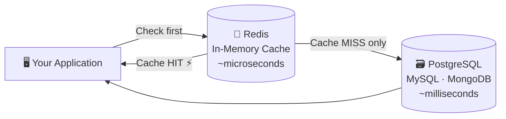

---

## In-Memory Databases — Redis Deep Dive

### Why In-Memory?

Redis stores all its data in **RAM**, not on disk. This makes it:

| Property | Detail |
|----------|--------|
| ⚡ **Speed** | Microsecond read/write latency |
| 🔑 **Simple** | Key-value structure, easy to use |
| ⚠️ **Volatile** | Data is lost on power loss (persistence options exist) |
| 📦 **Limited** | RAM is expensive — store only what's frequently needed |

---

### Caching Strategies

#### Strategy 1: Lazy Caching (Cache-Aside)

The most common strategy. Data is only loaded into the cache when it's actually requested. The application drives all cache interactions.

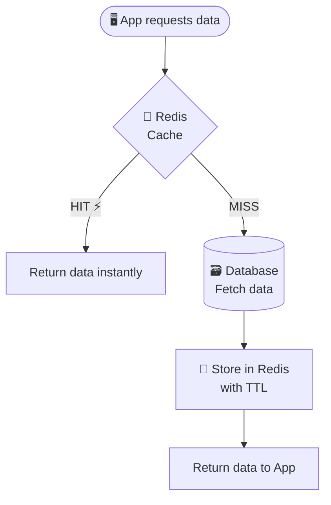

> **Pros:** Cache only holds data that's actually requested — no wasted space.
> **Cons:** The very first request is always slow (cold start).

---

#### Strategy 2: Write-Through Caching

Every time data is **written**, it goes to **both** the cache and the database simultaneously. The cache is always in sync.

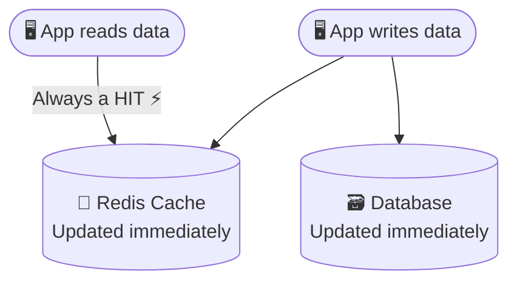

> **Pros:** Data is always fresh — no stale reads ever.
> **Cons:** Every write is slightly slower (two writes instead of one). Cache fills up even with rarely-read data.

---

### Eviction Policies

RAM is limited. When the cache fills up, Redis must decide what to **delete** to make room. This is governed by eviction policies:

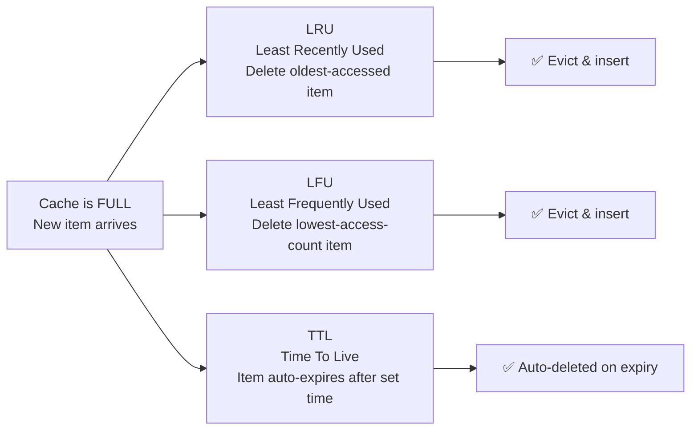

| Policy | How it decides | Best for |
|--------|---------------|----------|
| **LRU** | Delete the item not accessed for the longest time | General use — recently used data is likely needed again |
| **LFU** | Delete the item with the lowest total access count | Keeping genuinely "hot" viral content |
| **TTL** | Delete after a fixed timer, regardless of usage | Data that becomes stale over time (weather, trending) |

**Visual intuition for LRU** — cache with 4 slots:

```
 Time →     t1    t2    t3    t4    t5    t6    t7 (new item E arrives!)
 Item A      A     A     A     A     A     A     A   ← accessed at t1, t5
 Item B            B     B     B     B     B     B   ← accessed at t2, t6
 Item C                  C     C     C     C    [E]  ← C evicted (oldest: t3)
 Item D                        D     D     D     D   ← accessed at t4
```

---

## Common Backend Use Cases

### 1. 🗃️ Database Query Caching

Complex SQL joins across multiple large tables can take seconds. If thousands of users request the same report, running the query every time is wasteful.

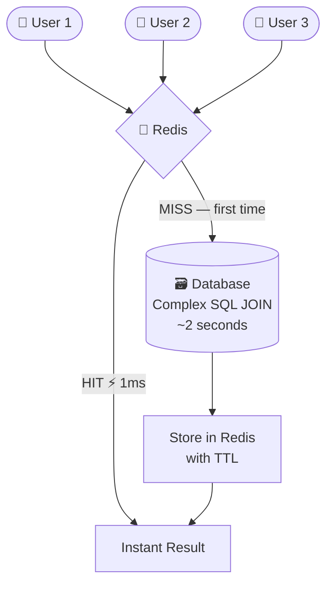

**Typical code pattern:**
```python
cache_key = "monthly_sales_report_2025_05"
result = redis.get(cache_key)

if not result:
    result = db.execute("SELECT ... complex JOIN ...")
    redis.set(cache_key, result, ttl=3600)  # cache for 1 hour

return result
```

---

### 2. 🔐 Session Storage

Every API call from a logged-in user needs to verify: "Is this token valid?" Hitting the main database every time adds latency to every single request.

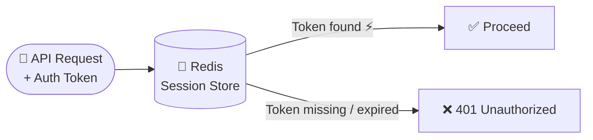

Redis is perfect because TTL naturally handles session expiry, reads are in microseconds, and it scales to millions of concurrent sessions.

---

### 3. 🌦️ API Response Caching

When your app calls a third-party API (e.g., OpenWeatherMap), you're billed per request and subject to rate limits. Cache the response once and serve all users from it.

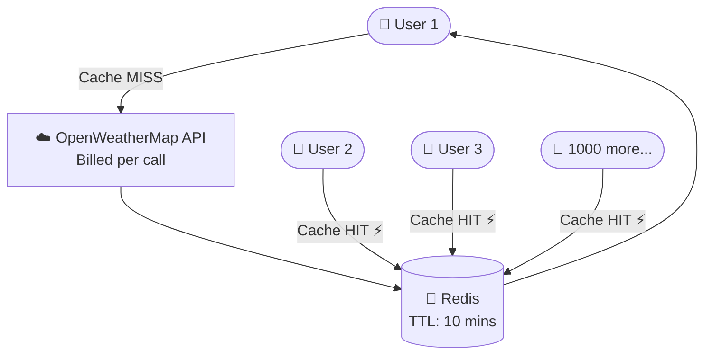

> 1,000 users → **1 API call** instead of 1,000. Saves money and avoids rate limits.

---

### 4. 🚦 Rate Limiting

Redis maintains per-user request counters to prevent API abuse. It's fast enough to check and increment on every single request without becoming a bottleneck.

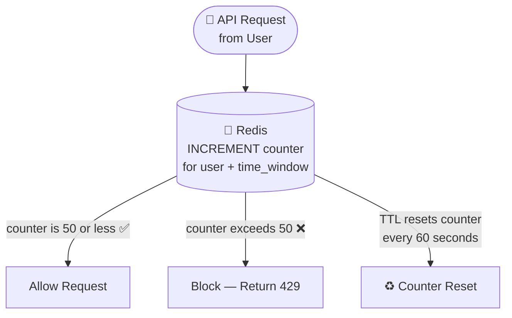

| Approach | Latency per check | At 1,000 req/sec |
|----------|------------------|-----------------|
| Main Database | ~5 ms | 5 sec of DB time/sec ❌ |
| Redis | ~0.1 ms | 100 ms of Redis time/sec ✅ |

---

## Quick Reference Cheat Sheet

| Concept | One-liner explanation |
|---------|----------------------|
| **Cache Hit** | Requested data IS in the cache → fast ⚡ |
| **Cache Miss** | Requested data NOT in cache → go to DB |
| **TTL** | How long before cached data auto-expires |
| **Eviction** | Removing old data to make room for new |
| **LRU** | Delete what hasn't been used recently |
| **LFU** | Delete what's been used least overall |
| **CDN** | Geographic cache for static files (Netflix) |
| **DNS Cache** | Stored IP addresses at multiple layers |
| **Redis** | Popular in-memory key-value cache/DB |
| **Lazy Caching** | Cache only on first request (on-demand) |
| **Write-Through** | Update cache + DB simultaneously |
| **Rate Limiting** | Use Redis counter to cap req/min per user |
| **Session Storage** | Store auth tokens in Redis, not main DB |

### ⚡ Speed Reference

| Storage | Latency | Relative Speed |
|---------|---------|----------------|
| L1 CPU Cache | ~1 ns | 🟢🟢🟢🟢🟢 |
| L2/L3 CPU Cache | ~4–10 ns | 🟢🟢🟢🟢 |
| RAM / Redis | ~100 ns | 🟢🟢🟢 |
| SSD | ~100 µs | 🟡🟡 |
| Network (local) | ~1 ms | 🟡 |
| DB query (cold) | ~10–100 ms | 🔴 |
| HDD seek | ~10 ms | 🔴 |

---

## 🧠 Mental Model Summary

Think of caching as a series of **layers around your data** — each faster and smaller than the last. The goal: answer requests from the highest (fastest) layer possible.

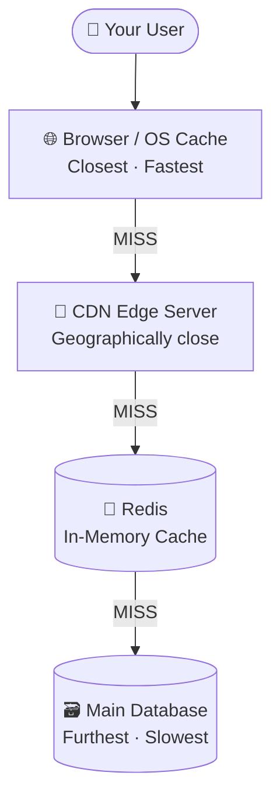

| Layer | Speed | Size | Cost |
|-------|-------|------|------|
| Browser / OS | Fastest | Smallest | Most expensive |
| CDN Edge | Very fast | Large | Medium |
| Redis | Fast | Medium | Medium |
| Main DB | Slowest | Largest | Cheapest |

---

